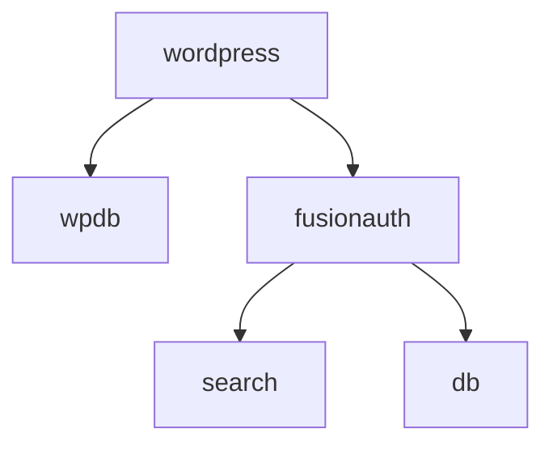

# FusionAuth Express Quickstart

## Documentation

This repository is documented at https://fusionauth.io/docs/quickstarts/quickstart-javascript-express-web.

Further reading:
- [Express security best practice](https://expressjs.com/en/advanced/best-practice-security.html)
- [Passport.js authentication concepts](https://www.passportjs.org/concepts/authentication/downloads/html)
- [Passport.js Oauth2](https://github.com/jaredhanson/passport-oauth2)
- [FusionAuth OAuth Docs](https://fusionauth.io/docs/v1/tech/oauth/endpoints)

## Prerequisites

Install Docker 20 or higher.

## How To Run

In a terminal run the following to start FusionAuth.

```shell
docker-compose up
```

In another terminal start the app.

```shell
cd complete-application
docker compose up; # https://hub.docker.com/_/wordpress
# change to this - https://github.com/FusionAuth/fusionauth-example-wordpress-sso/blob/main/docker-compose.yml
```



Browse to the app at http://localhost:3000.

- http://localhost:3000/wp-admin/install.php
- English US - Continue
- 1.jpg + admin@example.com
- login with u u

plugins - add new
# paste https://wordpress.org/plugins/miniorange-login-with-eve-online-google-facebook into search
# source code is here - https://github.com/oidc-wp/openid-connect-generic
paste OpenID Connect Generic Client into search by daggerhart
add - activate
settings - OpenID Connect - Generic Client

clientid - E9FDB985-9173-4E01-9D73-AC2D60D1DC8E
secret - super-secret-secret-that-should-be-regenerated-for-production
scope - openid
loginurl - http://localhost:9011/oauth2/authorize
userinfo endpoint - http://fusionauth:9011/oauth2/userinfo
Token Validation Endpoint URL - http://fusionauth:9011/oauth2/token
End Session Endpoint URL - http://localhost:9011/oauth2/logout

- Check “Disable SSL Verify” since none of our docker instances are running HTTPS.
- Change the “Identity Key” and “Nickname Key” values to sub. This is what WordPress will use as Ids internally.
- Change the “Display Name Formatting” to {email}. This is what will be displayed to the user in the WordPress admin screen.
- Check “Link Existing Users” if users in your local WordPress database have the same emails as users in your FusionAuth database; otherwise you’ll see an error when those users try to log in.
- Redirect Back to Origin Page // nah, doesn't help
- save

login redirect urls in fa:
# http://localhost:3000/wp-admin/admin-ajax.php?action=openid-connect-authorize
# http://localhost:3000/wp-login.php?loggedout=true&wp_lang=en_US

now login is possible, restrict page access with simple page access restriction by Plugins & Snippets
- settings
- url
- http://localhost:3000/wp-login.php
- supported types posts and pages
- edit sample page - bottom right - enable - For Logged-In Users Only

users get send to dashboard after login, rather send them to account.
- install Remove Dashboard Access by TrustedLogin
- settings - dashboard access
- administrators only - leave at that
- redirect url - http://localhost:3000/account
- disable - Allow all users to edit their profiles in the dashboard.

settings - permalinks
- permalink structure - postname

pages
- sample page
- quick edit
- title Account
- slug account
- make new page Home
- make new page Change (restrict to logged in at bottom right)

settings - readings settings
- your homepage displays - a static page - home

Remove wp login so only fa login page is usable
```bash
docker exec -it fusionauth-quickstart-wordpress-web-wordpress-1 bash
apt-get update && apt-get install -y vim
vim
:set number

start 1424 <!-- before <form name="loginform"
end   1504 -->  after </p>

:wq
```

<!--
# docker cp fusionauth-quickstart-wordpress-web-wordpress-1:/var/www/html/wp-login.php ./mysite/wp-login.php
docker cp ./mysite/wp-login.php fusionauth-quickstart-wordpress-web-wordpress-1:/var/www/html/wp-login.php

sudo apt install mysql-client-core-8.0

mysql -h 0.0.0.0 -pu -u u -P 3306
use mysite
show tables;
SHOW COLUMNS FROM wp_posts;
select post_content from wp_posts where post_type = 'page' and post_title = 'Change';
select post_content from wp_posts where post_type = 'page' and post_title = 'Home';
select post_content from wp_posts where post_type = 'page' and post_title = 'Account';

update wp_posts set post_content  = ... where post_title = 'Change';
no, you have to backup and restore a script for all columns for each page -->

- every page must have page template blank


- install snippet shortcodes (sc-user-email - [sv slug="sc-user-email"])
- install wp coder plugin
- wow plugins - wp coder
- add new
- insert title "Account"
- paste html, css
- repeat for change, home

delete all existing pages, add three blank pages: home, account, change
edit each - add [WP-Coder title="change"]

alternative approaches
- edit twentytwentythree theme (make a child theme), edit the css and add new template files for each page
- make a custom shortcode
- make a custom block
- make a custom plugin


media library - add new
- money.jpg
- media library - click file - copy File URL: from bottom right
- at bottom of home.html replace the src attribute of the last img element with file url

appearance - editor - Templates - Blank - Pen icon (edit)
- click on the only block on the page (that says "This is the Post Content block, it will display all the blocks in any single post or page.")
- on the right, disable, "Inner blocks use content width".
- Save
- Now all your pages should be full width
